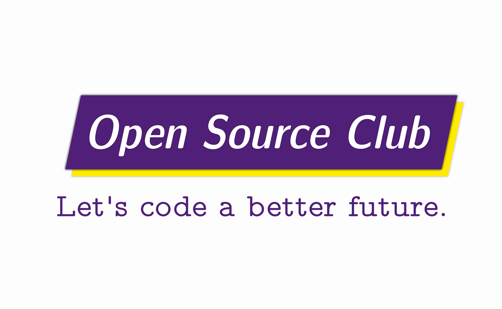

# Assets 

This repository stores source files for our logos, posters, etc. These materials are licensed under the terms of the [Creative Commons Attribution-ShareAlike 4.0](https://creativecommons.org/licenses/by-sa/4.0/legalcode). 

[Notice of Deprecation: Our planning has moved here](https://github.com/orgs/Hunter-Open-Source-Club/projects/2)
---

## Events

### Creating with Open Source software
topics: generative art / digital painting / digital postproduction
audience: photographers/ designers, beginners
software: Krita/Darktable/Inkscape
goal: make designs for shirts for the club, sell them to Hunter CS and art students for club fundraising

### Beautiful Documents and Notes with OSS
topics: Latex, Markdown, GitHub (and git)
audience: all, intermediate
software: pandoc/LaTeX/markdown/rmarkdown

~~### Pre Discrete Structures Workshop
topics: proofs, combinatorics
period: at least 4 sessions at 2 hours long, volunteers permitting
audence: those taking discrete next semester
reference: _Book of Proof_ by Richard Hammack~~

## Projects

~~### Cooperman Business Center Website re-write (active)~~

## Video

Use OSS to make math tutorial videos
